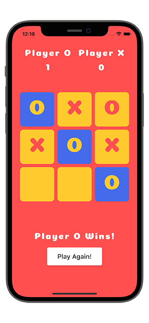
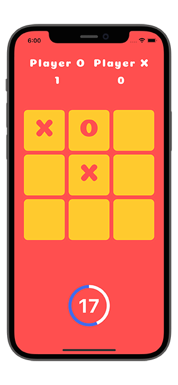

# Flutter Tic-Tac-Toe

In this project I have created a [Tic-Tac-Toe game app in Flutter](https://youtu.be/ZWyeW6VWJC8). Here I have added a timer and when the countdown is active that time only the user can play the game. If the countdown completes before the game has been finished then the match will be draw and nobody will win the game.

## Watch it on YouTube
This repository is part of a tutorial on my YouTube.
- [Flutter Tic-Tac-Toe Tutorial for Beginners](https://youtu.be/ZWyeW6VWJC8)

## Screenshot

